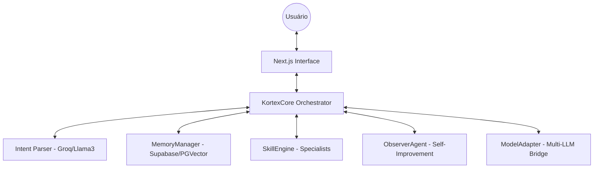

# 🦾 KORTEX: Orquestrador de IA Avançado

KORTEX é um assistente virtual modular e inteligente, construído com **Next.js 14**, projetado para unir a velocidade do **Groq** com a inteligência contextual do **Google Gemini**. Ele possui memória de longo prazo, um motor de habilidades (skills) dinâmico e auto-supervisão.

## 🚀 Funcionalidades Principais

- **Orquestração Multi-LLM**: Alterna entre Llama 3.3 (Groq) e Gemini Pro conforme a necessidade.
- **Memória de Longo Prazo (LTM)**: Utiliza **Supabase PGVector** para lembrar preferências e contextos passados.
- **Motor de Skills Especialistas**: Carrega dinamicamente scripts de habilidades (`SKILL.md`) para realizar tarefas complexas.
- **Agente Observador**: Analisa logs de execução para sugerir melhorias contínuas no sistema.
- **Interface Premium**: UI moderna, dark mode, otimizada para produtividade.

## 🏗️ Arquitetura do Sistema



## 🛠️ Configuração Inicial

### 1. Requisitos
- Node.js 18+
- Conta no Supabase
- Chaves de API: Groq e Google AI (Gemini)

### 2. Variáveis de Ambiente
Crie um arquivo `.env` na raiz da pasta `kortex-app` seguindo o modelo:
```env
GROQ_API_KEY=sua_chave_aqui
GOOGLE_AI_KEY=sua_chave_aqui
NEXT_PUBLIC_SUPABASE_URL=sua_url_supabase
NEXT_PUBLIC_SUPABASE_ANON_KEY=sua_chave_anonima
```

### 3. Banco de Dados (Memória)
Execute o script SQL contido em `supabase_setup.sql` no terminal SQL do seu projeto Supabase para habilitar a extensão `pgvector` e criar a tabela de memórias.

### 4. Instalação e Execução
```bash
npm install
npm run dev
```
Acesse [http://localhost:3000](http://localhost:3000).

## 📂 Estrutura do Projeto

- `src/lib/kortex-core.ts`: O "cérebro" que processa intenções.
- `src/lib/memory-manager.ts`: Gerencia a persistência no Supabase.
- `src/lib/skill-engine.ts`: Carrega e gerencia habilidades especialistas.
- `src/lib/observer-agent.ts`: Monitora e analisa a performance.
- `src/app/page.tsx`: Interface de chat principal.

## 🧠 Como Expandir
Para adicionar uma nova habilidade ao KORTEX, basta criar uma nova pasta em `../skills` contendo um arquivo `SKILL.md` com as instruções do especialista. O KORTEX a detectará automaticamente na próxima interação.

---
*Desenvolvido como um protótipo de assistente autônomo de próxima geração.*
